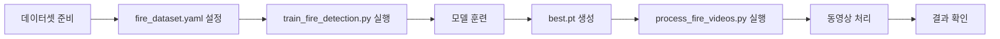

# 🔥 불꽃 감지 프로젝트 (Fire Detection Project)

YOLO를 사용한 불꽃 감지 모델 훈련 및 동영상 처리 프로젝트입니다.

## 📁 프로젝트 구조

```
monoculus/
├── fire_dataset.yaml           # 데이터셋 설정 파일
├── train_fire_detection.py     # 모델 훈련 스크립트
├── process_fire_videos.py      # 동영상 처리 스크립트
├── yolo_video_gpu.py           # 범용 YOLO 동영상 처리
├── assets/
│   ├── home fire/              # 훈련 데이터셋
│   │   ├── train/
│   │   │   ├── images/        # 훈련 이미지
│   │   │   └── labels/        # 훈련 라벨 (YOLO 형식)
│   │   ├── val/
│   │   │   ├── images/        # 검증 이미지
│   │   │   └── labels/        # 검증 라벨
│   │   └── test/
│   │       ├── images/        # 테스트 이미지
│   │       └── labels/        # 테스트 라벨
│   ├── bucket11.mp4           # 테스트 동영상 1
│   ├── printer31.mp4          # 테스트 동영상 2
│   └── roomfire41.mp4         # 테스트 동영상 3
└── fire_detection_runs/        # 훈련 결과 (자동 생성)
    └── fire_model/
        ├── weights/
        │   ├── best.pt        # 최고 성능 모델
        │   └── last.pt        # 마지막 에포크 모델
        └── ...                 # 훈련 로그, 그래프 등
```

## 🚀 사용 방법

### 1단계: 환경 설정

필요한 패키지 설치:

```bash
pip install ultralytics torch torchvision opencv-python numpy
```

GPU 사용 시 CUDA 설치 확인:

```bash
python -c "import torch; print(f'CUDA Available: {torch.cuda.is_available()}')"
```

### 2단계: 모델 훈련

기본 설정으로 훈련 (권장):

```bash
python train_fire_detection.py
```

고급 옵션 사용:

```bash
# 더 큰 모델 사용 (정확도 향상)
python train_fire_detection.py --model yolov8s.pt --epochs 150

# 배치 크기 조정 (GPU 메모리에 따라)
python train_fire_detection.py --batch 8  # GPU 메모리 부족 시
python train_fire_detection.py --batch 32 # GPU 메모리 충분 시

# 전체 옵션
python train_fire_detection.py \
    --model yolov8n.pt \
    --epochs 100 \
    --batch 16 \
    --imgsz 640 \
    --name fire_model_v1
```

#### 모델 선택 가이드

| 모델 | 크기 | 속도 | 정확도 | GPU 메모리 | 추천 용도 |
|------|------|------|--------|-----------|----------|
| yolov8n.pt | 3MB | 매우 빠름 | 중간 | 2GB | 실시간 처리, 빠른 실험 |
| yolov8s.pt | 11MB | 빠름 | 좋음 | 4GB | 균형잡힌 성능 (권장) |
| yolov8m.pt | 26MB | 보통 | 매우 좋음 | 6GB | 높은 정확도 필요 시 |
| yolov8l.pt | 44MB | 느림 | 최고 | 8GB | 최고 성능 필요 시 |

### 3단계: 동영상 처리

훈련된 모델로 동영상 처리:

```bash
# assets 폴더의 모든 동영상 처리
python process_fire_videos.py \
    --model fire_detection_runs/fire_model/weights/best.pt \
    --video-dir assets

# 특정 동영상만 처리
python process_fire_videos.py \
    --model fire_detection_runs/fire_model/weights/best.pt \
    --videos assets/bucket11.mp4 assets/printer31.mp4 assets/roomfire41.mp4

# 신뢰도 임계값 조정
python process_fire_videos.py \
    --model fire_detection_runs/fire_model/weights/best.pt \
    --video-dir assets \
    --confidence 0.7  # 더 확실한 감지만 표시 (기본값: 0.5)
```

#### 신뢰도 임계값 가이드

- `0.3-0.4`: 낮은 임계값 - 모든 가능성 감지 (False Positive 많음)
- `0.5`: 기본값 - 균형잡힌 감지
- `0.6-0.7`: 높은 임계값 - 확실한 감지만 (권장)
- `0.8-0.9`: 매우 높은 임계값 - 매우 확실한 경우만

### 4단계: 결과 확인

처리된 동영상은 `fire_detected_videos/` 폴더에 저장됩니다:

```
fire_detected_videos/
├── bucket11_fire_detected.mp4
├── printer31_fire_detected.mp4
└── roomfire41_fire_detected.mp4
```

## 📊 훈련 결과 분석

훈련 완료 후 `fire_detection_runs/fire_model/` 폴더에서 다음 파일들을 확인할 수 있습니다:

- `weights/best.pt`: 최고 성능 모델
- `weights/last.pt`: 마지막 에포크 모델
- `results.png`: 훈련/검증 손실 그래프
- `confusion_matrix.png`: 혼동 행렬
- `F1_curve.png`: F1 스코어 곡선
- `PR_curve.png`: Precision-Recall 곡선

### 주요 메트릭 설명

- **mAP50**: IoU 50%에서의 평균 정밀도 (높을수록 좋음, 목표: >0.7)
- **mAP50-95**: IoU 50-95%에서의 평균 정밀도 (높을수록 좋음, 목표: >0.5)
- **Precision**: 감지된 것 중 실제 불꽃의 비율 (높을수록 좋음)
- **Recall**: 실제 불꽃 중 감지된 것의 비율 (높을수록 좋음)

## 🔧 문제 해결

### GPU 메모리 부족

```bash
# 배치 크기 줄이기
python train_fire_detection.py --batch 8

# 이미지 크기 줄이기
python train_fire_detection.py --imgsz 416
```

### 훈련 속도가 너무 느림

```bash
# GPU 사용 확인
python -c "import torch; print(torch.cuda.is_available())"

# 더 작은 모델 사용
python train_fire_detection.py --model yolov8n.pt

# 에포크 수 줄이기
python train_fire_detection.py --epochs 50
```

### 감지 성능이 좋지 않음

1. **더 많은 데이터 추가**: 데이터셋에 더 다양한 불꽃 이미지 추가
2. **더 긴 훈련**: `--epochs 200` 등으로 훈련 시간 늘리기
3. **더 큰 모델 사용**: `--model yolov8s.pt` 또는 `yolov8m.pt`
4. **데이터 증강 확인**: `train_fire_detection.py`의 증강 옵션 조정
5. **신뢰도 임계값 조정**: `--confidence 0.4` 등으로 낮추기

## 💡 추가 팁

### 실시간 웹캠 감지

```python
from ultralytics import YOLO

model = YOLO('fire_detection_runs/fire_model/weights/best.pt')
results = model.predict(source=0, show=True, conf=0.5)  # 0 = 웹캠
```

### 이미지 감지

```bash
yolo predict model=fire_detection_runs/fire_model/weights/best.pt source=image.jpg
```

### 모델 내보내기 (배포용)

```bash
# ONNX 형식으로 내보내기
yolo export model=fire_detection_runs/fire_model/weights/best.pt format=onnx

# TensorRT 형식으로 내보내기 (NVIDIA GPU 최적화)
yolo export model=fire_detection_runs/fire_model/weights/best.pt format=engine
```

## 📝 주요 파일 설명

### `fire_dataset.yaml`
- 데이터셋 경로와 클래스 정의
- 훈련/검증/테스트 데이터 위치 지정

### `train_fire_detection.py`
- YOLO 모델 훈련 스크립트
- GPU 최적화 및 데이터 증강 설정
- 훈련 진행 상황 모니터링

### `process_fire_videos.py`
- 훈련된 모델로 동영상 처리
- 배치 처리 지원
- 불꽃 감지 통계 제공

## 🎯 프로젝트 워크플로우



## 🤝 기여

이슈나 개선 사항이 있으면 GitHub에서 이슈를 생성해주세요.

## 📄 라이선스

이 프로젝트는 교육 목적으로 제작되었습니다.
